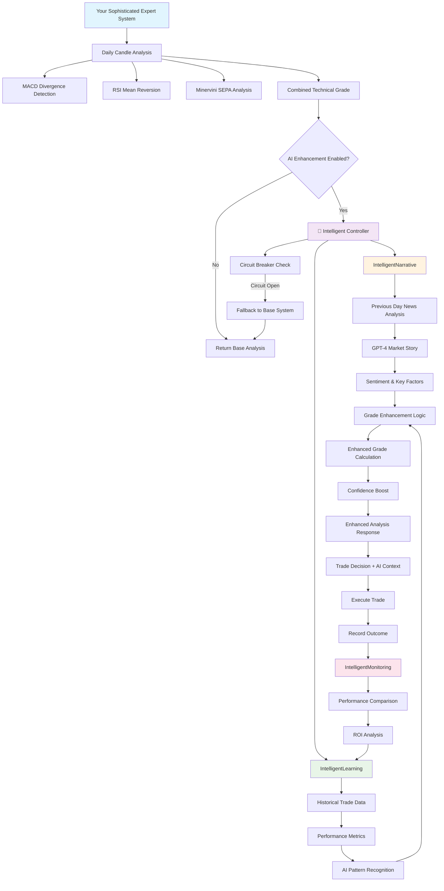

# 🔄 Intelligent System Workflow & Architecture

## 📊 **COMPLETE SYSTEM WORKFLOW**



## 🏗️ **WHERE YOUR SOPHISTICATED SYSTEM FITS**

### **Your Expert System (Base Layer)**
```
📍 Location: Core of the entire system
📊 Function: Primary analysis engine
🔧 Components:
  ├── MACD Divergence Detection
  ├── RSI Mean Reversion Analysis  
  ├── Minervini SEPA System
  ├── Volume & Price Action Analysis
  └── Combined Technical Grading (A+ to F)

💡 Status: UNCHANGED - Your system remains the foundation
```

### **AI Enhancement Layer (Optional Layer)**
```
📍 Location: Wraps around your expert system
📊 Function: Enhances but never replaces your analysis
🔧 Components:
  ├── IntelligentNarrative (Market Context)
  ├── IntelligentLearning (Historical Patterns)
  ├── IntelligentMonitoring (Performance Tracking)
  └── Circuit Breaker (Safety Net)

💡 Status: ADDITIVE - Can be turned off completely
```

## 🔄 **DETAILED WORKFLOW EXPLANATION**

### **Phase 1: Your Expert Analysis (Unchanged)**
1. **Daily Candle Processing**: Your system analyzes completed previous-day data
2. **Technical Analysis**: MACD, RSI, Minervini systems run as normal
3. **Grade Assignment**: Your sophisticated grading system assigns A+ to F
4. **Confidence Calculation**: Your existing confidence scoring (0.0-1.0)

### **Phase 2: AI Enhancement Decision Point**
```javascript
// Integration Point in Your System
const baseAnalysis = {
  symbol: 'AAPL',
  action: 'BUY',
  grade: 'B+',        // Your system's grade
  confidence: 0.75,   // Your system's confidence
  reasoning: 'MACD divergence + RSI oversold'
};

// AI Enhancement (Optional)
if (AI_ENHANCEMENT_ENABLED) {
  const enhanced = await intelligentController.enhanceAnalysis(baseAnalysis);
  return enhanced; // B+ might become A-, confidence 0.75 -> 0.82
} else {
  return baseAnalysis; // Your system unchanged
}
```

### **Phase 3: AI Processing (When Enabled)**

#### **3A: IntelligentNarrative**
- **Input**: Symbol + your analysis
- **Process**: 
  - Analyzes previous day's news (matches your candle approach)
  - GPT-4 generates market context story
  - Extracts sentiment, key factors, risk factors
- **Output**: Market narrative context
- **Fallback**: Returns neutral story if AI fails

#### **3B: IntelligentLearning**
- **Input**: Symbol + historical trade data
- **Process**:
  - Analyzes past performance for this symbol
  - Identifies what worked/didn't work
  - AI pattern recognition on trade outcomes
- **Output**: Performance insights and recommendations
- **Fallback**: Returns "no history" if learning fails

#### **3C: Grade Enhancement Logic**
```javascript
// Simplified Enhancement Logic
let gradeBoost = 0;

// Positive market narrative
if (narrative.sentiment === 'POSITIVE' && narrative.confidence > 0.7) {
  gradeBoost += 0.5; // B+ -> A-
}

// Strong historical performance
if (learning.winRate > 70 && learning.tradeCount >= 10) {
  gradeBoost += 0.3; // Additional boost
}

// Risk factors detected
if (narrative.riskFactors.length > 2) {
  gradeBoost -= 0.2; // Reduce grade
}

enhancedGrade = applyBoost(originalGrade, gradeBoost);
```

### **Phase 4: Enhanced Output**
```javascript
// What you get back
{
  // Your original analysis (preserved)
  symbol: 'AAPL',
  action: 'BUY',
  originalGrade: 'B+',
  baseConfidence: 0.75,
  
  // AI enhancements
  enhanced: true,
  enhancedGrade: 'A-',           // Upgraded from B+
  gradeImprovement: '+',
  aiConfidence: 0.82,            // Boosted from 0.75
  confidenceBoost: 0.07,
  
  // AI context
  narrative: "AAPL shows strong technical momentum supported by positive earnings sentiment...",
  keyFactors: ["Technical breakout", "Earnings beat"],
  riskFactors: ["Market volatility"],
  sentiment: "BULLISH",
  
  // Learning insights
  learningInsights: {
    hasHistory: true,
    winRate: 73,
    recommendations: ["Excellent win rate - consider position sizing"]
  },
  
  // Enhanced recommendation
  recommendation: "BUY A- - excellent opportunity with high confidence. Market narrative supports the position."
}
```

### **Phase 5: Trade Execution & Learning Loop**
1. **Trade Execution**: You execute the trade (enhanced or base)
2. **Outcome Recording**: When trade completes, record the result
3. **Performance Monitoring**: AI tracks performance vs baseline
4. **Learning Update**: System learns from the outcome
5. **ROI Analysis**: Measures if AI enhancement was worth the cost

## 🛡️ **SAFETY & FALLBACK MECHANISMS**

### **Circuit Breaker Protection**
```javascript
// If AI fails 5 times in 5 minutes
if (aiFailures >= 5) {
  circuitBreaker.open();
  return originalAnalysis; // Your system unchanged
}
```

### **Graceful Degradation**
- **OpenAI API Down**: Returns neutral narrative, your analysis proceeds
- **Database Error**: Returns "no history", your analysis proceeds  
- **Timeout**: After 20 seconds, falls back to your analysis
- **Invalid Response**: Parses what it can, falls back for the rest

## 📈 **PERFORMANCE TRACKING**

### **What Gets Monitored**
```javascript
// AI Enhanced Trades
{
  symbol: 'AAPL',
  originalGrade: 'B+',
  enhancedGrade: 'A-',
  outcome: 'WIN',
  pnlPercent: 4.2,
  aiEnhanced: true
}

// Your Base System Trades  
{
  symbol: 'MSFT',
  grade: 'B+',
  outcome: 'WIN', 
  pnlPercent: 3.1,
  aiEnhanced: false
}
```

### **Performance Comparison**
- **Win Rate**: AI-enhanced vs baseline
- **Average Return**: Per trade comparison
- **Risk Metrics**: Drawdown, volatility, Sharpe ratio
- **ROI**: Cost of AI vs additional returns generated

## 🎯 **KEY INTEGRATION POINTS**

### **1. Primary Integration (Recommended)**
```javascript
// In your main analysis function
const enhancedAnalysis = await fetch('/api/intelligent/analysis', {
  method: 'POST',
  body: JSON.stringify({
    symbol: 'AAPL',
    action: 'BUY',
    grade: yourSystemGrade,     // B+
    confidence: yourConfidence,  // 0.75
    timeframe: '1D'
  })
});
```

### **2. Trade Recording (For Learning)**
```javascript
// When trade completes
await fetch('/api/intelligent/learning/record', {
  method: 'POST',
  body: JSON.stringify({
    symbol: 'AAPL',
    outcome: 'WIN',
    pnlPercent: 4.2,
    aiEnhanced: true,
    originalGrade: 'B+',
    enhancedGrade: 'A-'
  })
});
```

### **3. Performance Monitoring**
```javascript
// Monthly performance review
const report = await fetch('/api/intelligent/performance?days=30');
// Shows AI ROI, win rate improvements, cost analysis
```

## 🔧 **CONFIGURATION & CONTROL**

### **Environment Variables**
```env
# Master switch - turn off AI completely
AI_ENHANCEMENT_ENABLED=true

# OpenAI integration
OPENAI_API_KEY=your_key_here

# Circuit breaker settings
AI_FAILURE_THRESHOLD=5
AI_TIMEOUT_MS=20000
AI_CACHE_EXPIRY_MS=300000
```

### **Runtime Control**
```javascript
// Check system health
GET /api/intelligent/health

// Test all components
GET /api/intelligent/test?symbol=AAPL

// Get performance metrics
GET /api/intelligent/metrics

// Clear caches (if needed)
POST /api/intelligent/cache/clear
```

## 🎉 **SUMMARY: YOUR SYSTEM + AI**

### **What Doesn't Change**
✅ Your sophisticated technical analysis systems  
✅ Your daily candle approach (AI works with this)  
✅ Your grading methodology (A+ to F)  
✅ Your risk management  
✅ Your trade execution logic  

### **What Gets Enhanced**
🚀 **Context**: Market narrative adds "why" to your "what"  
🚀 **Learning**: Historical performance improves future decisions  
🚀 **Confidence**: AI validation can boost conviction  
🚀 **Monitoring**: Precise ROI tracking of AI value  

### **Safety Guarantees**
🛡️ Can be disabled instantly without affecting your system  
🛡️ Falls back to your analysis if AI fails  
🛡️ Never replaces your sophisticated analysis  
🛡️ Only enhances what you already have  

**Result**: Your sophisticated expert system becomes even more sophisticated with AI-powered context, learning, and monitoring - but remains 100% reliable and under your control.
